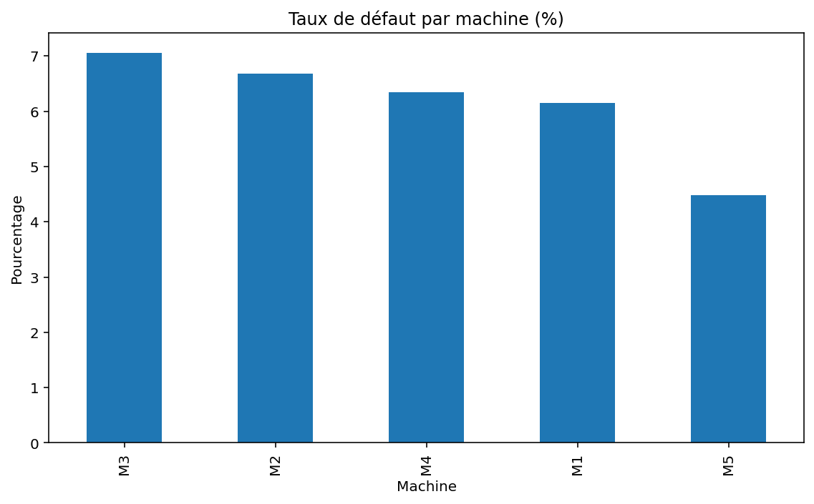
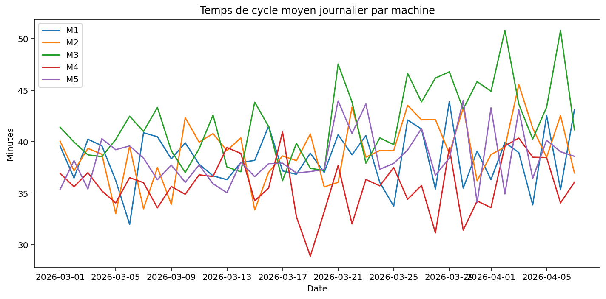

# Analyse de données de production industrielle  
### Détection de dérives et anomalies – Projet Python

## 📌 Contexte

Dans un environnement industriel, les données de production représentent un levier clé pour améliorer la performance, la qualité et la prise de décision.

Ce projet simule un cas d’usage inspiré d’un contexte réel (type aéronautique / production mécanique), avec des données incluant :
- temps de cycle
- statut qualité (OK / NOK)
- types de défauts
- machines et opérateurs

L’objectif est de démontrer une approche pragmatique de la data appliquée à l’amélioration continue.

---

## 🎯 Objectifs

Développer un outil capable d’exploiter automatiquement des données brutes de production afin de :

- identifier les dérives de qualité ou de performance  
- détecter des anomalies sur les temps de cycle  
- mettre en évidence des tendances exploitables  
- fournir des indicateurs simples pour la prise de décision  

---

## ⚙️ Fonctionnalités

Le script réalise automatiquement :

- calcul du taux de défaut global  
- analyse du taux de défaut par machine  
- identification des défauts les plus fréquents  
- comparaison entre période récente et historique  
- détection d’anomalies (z-score sur les temps de cycle)  
- génération de graphiques (matplotlib)  

---

## 📊 Exemple d’insights

Le projet permet de faire émerger des observations telles que :

- dérive du taux de défaut sur une machine donnée  
- augmentation de la variabilité sur certains types de pièces  
- détection d’événements atypiques (temps de cycle anormalement élevés)

---

## 🧠 Approche

Ce projet privilégie une approche **simple, robuste et orientée terrain** :

- transformation de données brutes en informations exploitables  
- logique d’amélioration continue  
- restitution claire sans nécessité d’expertise technique avancée  

---

## 🛠️ Technologies utilisées

- Python  
- pandas  
- matplotlib  
